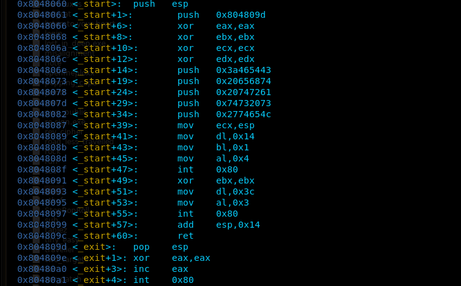

# Start

## Shellcode injection

This was not a typical shellcode injection challenge as the buffer size was very small(20bytes) so nop-sled technique couldn't work. When I disassembled the binary, there were only two "function" in it. The *entry* function and the *exit* functon. It seems as if it had been written in asm rather than writing in C and compiling. Anyways, First the binary outputs a wlecome message and then asks for input. After getting the input, it simply makes an **exit syscall** and the program ends. 

The entire disassembly of the binary can be seen here.

Now we can see `mov ecx,esp; mov dl,0x14; mov bl,0x1; mov al,0x4; int 0x80` which is the write syscall. The disassembly start by pushing esp on the stack. Also in the end `add esp,0x14` clears the stack of *entry* function so we can get an esp leak if we jump back to this write syscall after entry. 

Thus, the first payload gives us the stack leak for us to insert our shellcode in the write place. 
Now we jump straight to the read syscall afer this as there is no `ret` instruction after the write syscall. Since, the buffer is only 20 bytes in size, so instead of putting shellcode in the buffer we put it above the *saved return address* on the stack and jump to it. Thus, the next jump instruction executes our shellcode and the shell is spawned. 	:cowboy\_hat\_face:
